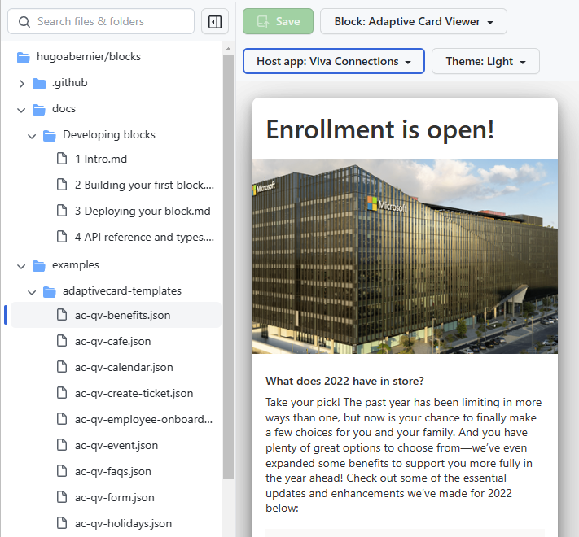

# Adaptive Card Viewer GitHub Block

Preview your [Adaptive Card](https://adaptivecards.io/) JSON within a GitHub repo.



## Quickstart

> 🛑 Currently, you must be flagged into the [GitHub Blocks Technical Preview](https://blocks.githubnext.com) in order to develop blocks. There is no "offline" development mode at this time.

Fork this repo using the [`Use this template`](https://github.com/githubnext/blocks-template/generate) button above:


Then, clone _your_ repo (not [this one!](https://github.com/githubnext/blocks-template)) and get ready for action:

```bash
yarn # install dependencies
yarn start # start the dev server
# Or use npm, pnpm, you know the drill
```

When you visit [localhost:4000](https://localhost:4000) in your browser, you'll be
redirected to the Blocks app, but your locally-developed blocks will appear in the block picker:


(if you're using Safari (or another browser that doesn't permit calling `http` URLs from an `https` page), run `yarn start-https` and visit [https://localhost:4000](https://localhost:4000) instead.)

This template includes one example File Block and one Folder Block. The dev server supports hot reloading, so make some changes, and see what they do!

## Under the hood

I used the [adaptivecards](https://www.npmjs.com/package/adaptivecards) node module to render the Adaptive Cards.

I also had to reverse-engineer the [adaptivecards-designer](https://www.npmjs.com/package/adaptivecards-designer) because I didn't want to include _all_ the features, and I couldn't figure out how to resolve the dependencies with Webpack.

## Challenges

I didn't know how to dynamically add the CSS files for each host (I could not call `require`, and could not figure it out), so I created `.ts` files which contain the CSS. If anybody knows how to solve this, please let me know (or submit a PR).

## More Info

There are many sample `.json` files in my [blocks repo](https://github.com/hugoabernier/blocks/) if you want to try this Block.

Visit [githubnext/blocks](https://blocks.githubnext.com/githubnext/blocks) for a full tutorial, documentation, and examples.

## License

MIT


